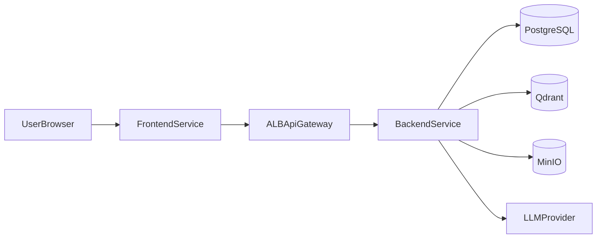

# Техническое задание (ТЗ) EduAI MVP

## 1. Назначение документа

Данный документ определяет технические требования для разработки и деплоя MVP-версии платформы EduAI.

Документ обязателен для:
- backend/frontend разработки;
- DevOps и эксплуатации;
- QA и приемочных проверок;
- архитектурного контроля изменений.

### 1.1 Источники baseline

ТЗ MVP синхронизировано с проектными документами:
- `documents/project_overview.md`
- `documents/BRD.md`
- `documents/AVD.md`
- `documents/system_architecture.md`
- `documents/database_schema.md`
- `documents/SOW.md`

### 1.2 Отличие MVP от полного ТЗ

MVP-версия не использует:
- Celery (фоновые workers);
- RabbitMQ (брокер задач);
- Redis (кэш).

Индексация лекций выполняется синхронно внутри backend-сервиса. Все остальные функциональные требования и API-контракты идентичны полному ТЗ.

---

## 2. Границы и целевая модель

### 2.1 Целевая архитектурная модель

- Deployment-модель: **2 отдельных сервиса**:
  - `frontend` service;
  - `backend` service.
- Backend реализуется как **modular monolith** (один deployable runtime) с внутренними модулями:
  - `auth`;
  - `content`;
  - `ai`;
  - `indexing`.

### 2.2 Технологический baseline MVP

- Frontend: Next.js/React + TypeScript.
- Backend: FastAPI (Python) или Go (единый runtime для backend).
- Data:
  - PostgreSQL (транзакционные данные),
  - Qdrant (векторный индекс),
  - MinIO (S3-совместимое хранилище).

### 2.3 Нефункциональные требования (NFR)

- Доступность пилота: >= 99.0% (месячное окно).
- P80 latency:
  - non-AI API <= 3s,
  - RAG <= 10s.
- 100% protected endpoints должны требовать JWT и проверку аутентификации.
- Полная трассируемость запросов через `request_id`/`trace_id`.

---

## 3. Логическая архитектура



### 3.1 Основные потоки

1. Login:
   - frontend -> backend `/api/v1/auth/login` -> JWT access/refresh.
2. Upload lecture:
   - user -> backend `content` -> metadata в PG + файл в MinIO.
3. Index lecture:
   - backend `indexing` модуль синхронно читает файл из MinIO -> chunk/embed -> Qdrant -> статус в PG.
4. RAG chat:
   - backend `ai` модуль синхронно retrieves context (Qdrant) + LLM -> response + message persistence.
5. Summary/Quiz:
   - backend `ai` генерирует материал по lecture context, сохраняет/возвращает в зависимости от endpoint политики.

---

## 4. Физическая архитектура (AWS ECS)

### 4.1 Сервисы

- ECS Service `eduai-frontend`:
  - отдельный task definition;
  - autoscaling по CPU/Memory/ALB requests;
  - healthcheck endpoint.
- ECS Service `eduai-backend`:
  - отдельный task definition;
  - autoscaling по CPU/Memory + latency/error signals.

### 4.2 Компоненты данных

- PostgreSQL: managed (предпочтительно RDS) или self-managed в private subnet.
- Qdrant: managed/self-managed.
- MinIO: self-managed S3-compatible storage (или миграция на S3 на следующих этапах).

### 4.3 Сеть и безопасность

- Внешний вход: ALB + HTTPS/TLS.
- Frontend/backend в отдельных ECS services.
- Data plane в private subnets.
- Security groups по принципу least privilege.
- Секреты через AWS Secrets Manager/SSM Parameter Store.

---

## 5. Конфигурация папок (обязательная)

### 5.1 Root структура репозитория

```text
/
  backend/
  frontend/
  infra/
  documents/
  scripts/
  .github/
```

### 5.2 Backend структура (modular monolith)

```text
backend/
  cmd/
    app/                    # entrypoint backend service
  internal/
    modules/
      auth/
        domain/
        usecase/
        interfaces/
        infrastructure/
      content/
        domain/
        usecase/
        interfaces/
        infrastructure/
      ai/
        domain/
        usecase/
        interfaces/
        infrastructure/
      indexing/
        domain/
        usecase/
        interfaces/
        infrastructure/
    platform/
      config/
      logging/
      middleware/
      security/
      observability/
    adapters/
      db_postgres/
      storage_minio/
      vector_qdrant/
      llm_provider/
  migrations/
  tests/
    unit/
    integration/
    contract/
  pyproject.toml or go.mod
  Dockerfile
```

### 5.3 Frontend структура

```text
frontend/
  src/
    app/                    # app shell, router, providers
    pages/ or routes/       # route entrypoints
    features/
      auth/
      lectures/
      rag_chat/
      summaries/
      quizzes/
    entities/
      user/
      lecture/
      chat/
      quiz/
    shared/
      api/
      ui/
      lib/
      config/
      types/
  public/
  tests/
    unit/
    integration/
    e2e/
  package.json
  Dockerfile
```

### 5.4 Infra и scripts

```text
infra/
  ecs/
    frontend/
    backend/
  networking/
  monitoring/
  env/
    stage.env.template
    prod.env.template

scripts/
  db/
    migrate.sh
    rollback.sh
    seed.sh
  ops/
    healthcheck.sh
    smoke-test.sh
```

### 5.5 Правила границ

- Модуль backend не импортирует внутренние пакеты другого модуля напрямую минуя публичный interface/usecase контракт.
- Любая внешняя интеграция идет только через `adapters/*`.
- Domain слой не зависит от infrastructure.
- Frontend `features/*` не должен напрямую ходить в инфраструктурные детали, только через `shared/api`.

---

## 6. Дизайн-паттерны (обязательные)

### 6.1 Backend

- **Hexagonal/Clean boundaries**:
  - domain/usecase слои независимы от транспортов/БД.
- **Repository pattern**:
  - абстракции persistence на границе usecase -> infra.
- **Service + UseCase orchestration**:
  - endpoint вызывает usecase, usecase координирует бизнес-операции.
- **Unit of Work**:
  - для сценариев с несколькими связанными изменениями в БД.
- **Idempotency pattern**:
  - для trigger endpoints (`/index`, `/summaries`, `/quizzes`) с `Idempotency-Key`.

### 6.2 Frontend

- **Feature-Sliced organization**:
  - функциональная декомпозиция через `features/entities/shared`.
- **Container/Presentational split**:
  - в сложных UI экранах отделение orchestration и отображения.
- **API client abstraction**:
  - единый typed API client, единый error mapping.
- **Caching strategy**:
  - SWR/React Query c TTL, stale-while-revalidate, invalidation policy.

---

## 7. API и контракты

### 7.1 Базовые правила API

- Base path: `/api/v1`.
- Все protected endpoints: `Authorization: Bearer <access_token>`.
- Единый error envelope:

```json
{
  "error": {
    "code": "RESOURCE_NOT_FOUND",
    "message": "Lecture not found",
    "request_id": "req_12345"
  }
}
```

### 7.2 Матрица доступа

| Endpoint | Тип доступа |
|---|---|
| `POST /api/v1/auth/register` | public |
| `POST /api/v1/auth/login` | public |
| `POST /api/v1/auth/refresh` | authenticated |
| `POST /api/v1/auth/logout` | authenticated |
| `GET /api/v1/auth/me` | authenticated |
| `POST /api/v1/lectures` | authenticated |
| `PATCH /api/v1/lectures/{lecture_id}` | authenticated |
| `DELETE /api/v1/lectures/{lecture_id}` | authenticated |
| `GET /api/v1/lectures` | authenticated |
| `GET /api/v1/lectures/{lecture_id}/content` | authenticated |
| `POST /api/v1/ai/lectures/{lecture_id}/index` | authenticated |
| `POST /api/v1/ai/chat/rag` | authenticated |
| `POST /api/v1/ai/lectures/{lecture_id}/summaries` | authenticated |
| `POST /api/v1/ai/lectures/{lecture_id}/quizzes` | authenticated |

### 7.3 Auth APIs

#### `POST /api/v1/auth/register`
- Request:
```json
{
  "email": "user@example.com",
  "password": "StrongPass123!",
  "first_name": "Alex",
  "last_name": "User"
}
```
- Response `201`:
```json
{
  "user_id": "usr_001",
  "email": "user@example.com",
  "first_name": "Alex",
  "last_name": "User"
}
```

#### `POST /api/v1/auth/login`
- Request:
```json
{
  "email": "user@example.com",
  "password": "StrongPass123!"
}
```
- Response `200`:
```json
{
  "access_token": "jwt_access",
  "refresh_token": "jwt_refresh",
  "expires_in": 900,
  "token_type": "Bearer"
}
```

#### `POST /api/v1/auth/refresh`
- Request:
```json
{
  "refresh_token": "jwt_refresh"
}
```
- Response `200`:
```json
{
  "access_token": "jwt_access_new",
  "expires_in": 900,
  "token_type": "Bearer"
}
```

#### `POST /api/v1/auth/logout`
- Response `204`.

#### `GET /api/v1/auth/me`
- Response `200`:
```json
{
  "user_id": "usr_001",
  "email": "user@example.com",
  "first_name": "Alex",
  "last_name": "User"
}
```

### 7.4 Content APIs

#### `POST /api/v1/lectures`
- Request:
```json
{
  "lecture_title": "Linear Algebra Lecture 1",
  "file_key": "uploads/lecture1.pdf"
}
```
- Response `201`:
```json
{
  "lecture_id": "lec_1001",
  "user_id": "usr_001",
  "lecture_title": "Linear Algebra Lecture 1",
  "file_key": "uploads/lecture1.pdf",
  "created_date": 1771755300,
  "deleted": 0
}
```

#### `DELETE /api/v1/lectures/{lecture_id}`
- Response `204`.

#### `PATCH /api/v1/lectures/{lecture_id}`
- Request:
```json
{
  "lecture_title": "Linear Algebra Lecture 1 - Updated"
}
```
- Response `200`:
```json
{
  "lecture_id": "lec_1001",
  "lecture_title": "Linear Algebra Lecture 1 - Updated"
}
```

#### `GET /api/v1/lectures/{lecture_id}/content`
- Response `200`:
```json
{
  "lecture_id": "lec_1001",
  "lecture_title": "Linear Algebra Lecture 1 - Updated",
  "file_key": "uploads/lecture1.pdf",
  "content": [
    {
      "section_id": "s1",
      "text": "A matrix is a rectangular array of numbers..."
    }
  ]
}
```

#### `GET /api/v1/lectures`
- Query params: `page`, `limit`, `search`.
- Response `200`:
```json
{
  "items": [
    {
      "lecture_id": "lec_1001",
      "user_id": "usr_001",
      "lecture_title": "Linear Algebra Lecture 1 - Updated",
      "file_key": "uploads/lecture1.pdf",
      "created_date": 1771755300,
      "deleted": 0
    }
  ],
  "page": 1,
  "limit": 20,
  "total": 1
}
```

### 7.5 AI APIs

#### `POST /api/v1/ai/lectures/{lecture_id}/index`
- Примечание MVP: индексация выполняется синхронно внутри backend-сервиса без внешнего брокера.
- Request:
```json
{
  "reindex": false,
  "chunk_size": 800,
  "chunk_overlap": 120
}
```
- Response `200`:
```json
{
  "job_id": "job_idx_009",
  "lecture_id": "lec_1001",
  "status": "completed"
}
```

#### `POST /api/v1/ai/chat/rag`
- Примечание: RAG выполняется синхронно (Qdrant + LLM внутри backend ai module).
- Request:
```json
{
  "chat_id": "chat_123",
  "content": {
    "text": "Explain matrix rank in simple terms"
  },
  "source": "web"
}
```
- Response `200`:
```json
{
  "message_id": "msg_456",
  "chat_id": "chat_123",
  "is_user": false,
  "content": {
    "text": "Matrix rank is the number of linearly independent rows or columns...",
    "source_documents": ["c_42", "c_17"]
  },
  "source": "script",
  "created_date": "2026-02-22T10:15:00Z"
}
```

#### `POST /api/v1/ai/lectures/{lecture_id}/summaries`
- Request:
```json
{
  "mode": "short",
  "language": "en",
  "max_tokens": 600
}
```
- Response `200`:
```json
{
  "lecture_id": "lec_1001",
  "summary": "This lecture introduces matrices, rank, and linear dependence..."
}
```

#### `POST /api/v1/ai/lectures/{lecture_id}/quizzes`
- Request:
```json
{
  "difficulty": "medium",
  "question_count": 10,
  "language": "en",
  "format": "mcq"
}
```
- Response `200`:
```json
{
  "lecture_id": "lec_1001",
  "quiz_id": "quiz_220",
  "questions": [
    {
      "id": "q1",
      "text": "What does matrix rank represent?",
      "options": ["Rows count", "Independent vectors count", "Trace value", "Determinant sign"],
      "answer": 1
    }
  ]
}
```

### 7.6 Контрактная дисциплина

- OpenAPI spec обязателен и version-controlled.
- Breaking changes запрещены без bump API version.
- Contract tests обязательны между frontend и backend.

---

## 8. Модель данных

### 8.1 Таблицы

#### `users` (auth module)
- `user_id` UUID (PK)
- `email` TEXT (UNIQUE, NOT NULL)
- `first_name` VARCHAR(255) (NOT NULL)
- `last_name` VARCHAR(255) (NOT NULL)
- `password_hash` VARCHAR(255) (NOT NULL)

#### `lectures` (content module)
- `lecture_id` UUID (PK)
- `user_id` UUID (FK -> `users.user_id`, ON DELETE CASCADE, NOT NULL)
- `lecture_title` TEXT (NOT NULL)
- `language` TEXT (NOT NULL, default: `en`)
- `file_key` TEXT (NOT NULL)
- `created_date` BIGINT (NOT NULL, unix timestamp)
- `deleted` SMALLINT (NOT NULL, `0/1`)

#### `chats` (ai module)
- `chat_id` UUID (PK)
- `user_id` UUID (FK -> `users.user_id`, ON DELETE CASCADE, NOT NULL)
- `chat_title` TEXT (NOT NULL)
- `created_date` BIGINT (NOT NULL, unix timestamp)
- `last_modified_date` BIGINT (NOT NULL, unix timestamp)
- `deleted` SMALLINT (NOT NULL, `0/1`)

#### `messages` (ai module)
- `message_id` UUID (PK)
- `chat_id` UUID (FK -> `chats.chat_id`, ON DELETE CASCADE, NOT NULL)
- `created_date` TIMESTAMPTZ (NOT NULL)
- `last_modified_date` TIMESTAMPTZ (NOT NULL)
- `is_user` BOOLEAN (NOT NULL)
- `content` JSONB (NOT NULL)
- `source` TEXT (`web` или `script`)

### 8.2 Минимальная SQL-схема

```sql
CREATE EXTENSION IF NOT EXISTS "pgcrypto";

CREATE TABLE users (
  user_id UUID PRIMARY KEY DEFAULT gen_random_uuid(),
  email TEXT NOT NULL UNIQUE,
  first_name VARCHAR(255) NOT NULL,
  last_name VARCHAR(255) NOT NULL,
  password_hash VARCHAR(255) NOT NULL
);

CREATE TABLE lectures (
  lecture_id UUID PRIMARY KEY DEFAULT gen_random_uuid(),
  user_id UUID NOT NULL REFERENCES users(user_id) ON DELETE CASCADE,
  lecture_title TEXT NOT NULL,
  language TEXT NOT NULL DEFAULT 'en',
  file_key TEXT NOT NULL,
  created_date BIGINT NOT NULL DEFAULT (EXTRACT(EPOCH FROM now())::BIGINT),
  deleted SMALLINT NOT NULL DEFAULT 0 CHECK (deleted IN (0, 1))
);

CREATE TABLE chats (
  chat_id UUID PRIMARY KEY DEFAULT gen_random_uuid(),
  user_id UUID NOT NULL REFERENCES users(user_id) ON DELETE CASCADE,
  chat_title TEXT NOT NULL,
  created_date BIGINT NOT NULL DEFAULT (EXTRACT(EPOCH FROM now())::BIGINT),
  last_modified_date BIGINT NOT NULL DEFAULT (EXTRACT(EPOCH FROM now())::BIGINT),
  deleted SMALLINT NOT NULL DEFAULT 0 CHECK (deleted IN (0, 1))
);

CREATE TABLE messages (
  message_id UUID PRIMARY KEY DEFAULT gen_random_uuid(),
  chat_id UUID NOT NULL REFERENCES chats(chat_id) ON DELETE CASCADE,
  created_date TIMESTAMPTZ NOT NULL DEFAULT now(),
  last_modified_date TIMESTAMPTZ NOT NULL DEFAULT now(),
  is_user BOOLEAN NOT NULL,
  content JSONB NOT NULL,
  source TEXT CHECK (source IN ('web', 'script'))
);

CREATE INDEX idx_lectures_user_id ON lectures(user_id);
CREATE INDEX idx_chats_user_id ON chats(user_id);
CREATE INDEX idx_messages_chat_id_created_date ON messages(chat_id, created_date);
```

### 8.3 Стандарты данных

- Временные поля: `TIMESTAMPTZ` (единый стандарт) где применимо.
- Soft delete: поле `deleted SMALLINT` вместо физического удаления.
- Все внешние ключи с явно заданной delete-policy (`CASCADE`).
- Индексы на частые фильтры и сортировки (`user_id`, `chat_id`, `created_date`).

### 8.4 `messages.content` JSON формат

Если `is_user = true`:
```json
{
  "text": "Explain matrix rank in simple terms"
}
```

Если `is_user = false`:
```json
{
  "text": "Matrix rank is the number of linearly independent rows or columns...",
  "source_documents": ["chunk_42", "chunk_17"]
}
```

---

## 9. Индексация лекций (MVP-подход без брокера)

### 9.1 Принцип работы

В MVP индексация выполняется **синхронно** внутри backend-сервиса при вызове `POST /api/v1/ai/lectures/{lecture_id}/index`:

1. Backend `indexing` модуль читает файл лекции из MinIO.
2. Выполняет chunking и генерацию embeddings.
3. Записывает векторы в Qdrant.
4. Обновляет статус в PostgreSQL (опционально через таблицу `ai_jobs`).
5. Возвращает ответ клиенту.

### 9.2 Таблица `ai_jobs` (опционально для MVP)

Для отслеживания статуса индексации:
- `job_id` UUID (PK)
- `lecture_id` UUID (FK -> `lectures.lecture_id`)
- `task_type` TEXT (`index`, `summary`, `quiz`)
- `status` TEXT (`running`, `completed`, `failed`)
- `error` TEXT (NULL если успех)
- `created_at` TIMESTAMPTZ
- `updated_at` TIMESTAMPTZ
- `finished_at` TIMESTAMPTZ (NULL до завершения)

### 9.3 Политика повторов

- При ошибке индексации endpoint возвращает соответствующий HTTP-статус.
- Клиент может повторно вызвать endpoint с `"reindex": true`.
- Идемпотентность обеспечивается через `Idempotency-Key` header.

---

## 10. Безопасность

### 10.1 AuthN/AuthZ

- JWT access/refresh.
- Refresh token rotation.
- Access model:
  - `user`: read/write content + AI triggers + собственные chats.
- Ownership rule для chats: `chats.user_id == token.user_id`.

### 10.2 Data protection

- TLS in transit.
- Encryption at rest (DB/object storage).
- Secret rotation policy для ключей и паролей.

### 10.3 Audit

- Аудит privileged действий:
  - upload/update/delete lecture;
  - index/summaries/quizzes triggers;
  - auth events (login/logout/refresh failures).

---

## 11. Наблюдаемость и эксплуатация

### 11.1 Логи

- JSON logs:
  - `request_id`,
  - `trace_id`,
  - `user_id` (если есть),
  - `service`,
  - `latency_ms`,
  - `error_code`.

### 11.2 Метрики

- API: RPS, P50/P80/P95 latency, 4xx/5xx rate.
- Backend runtime: CPU/memory/restarts.
- Data: DB pool saturation, Qdrant health.
- AI: model latency, token usage, indexing duration, retrieval quality.

### 11.3 Алерты

- Critical:
  - auth outage,
  - DB down,
  - 5xx spike.
- High:
  - RAG latency breach,
  - indexing failure rate spike.
- Medium:
  - AI error trend increase.

---

## 12. CI/CD

### 12.1 Pipeline этапы

1. Lint.
2. Unit tests.
3. Integration/contract tests.
4. Security checks (SAST/dependency scan).
5. Build image.
6. Push registry.
7. Deploy stage.
8. Smoke tests.
9. Manual/automated promotion to prod.

### 12.2 Release strategy

- `dev` -> auto deploy to `stage`.
- tagged release `vX.Y.Z` -> deploy `prod`.
- Rollback обязателен и документирован.

---

## 13. Тестовая стратегия

- Unit tests: бизнес-логика модулей.
- Integration tests: DB (PostgreSQL), MinIO, Qdrant.
- Contract tests: frontend/backend API contracts.
- E2E:
  - login,
  - lecture upload/list,
  - index flow (синхронный),
  - RAG chat,
  - summary/quiz flow.
- Load tests:
  - non-AI endpoints,
  - RAG endpoint,
  - indexing endpoint.

---

## 14. Definition of Done (DoD)

Задача считается завершенной, если:
- реализован код + тесты;
- обновлены API контракты (если менялись);
- обновлены документы (архитектура/операционные runbooks);
- есть метрики/логи для новой функциональности;
- пройден деплой в stage и smoke checks;
- нет критических/высоких дефектов для релиза.

---

## 15. Критерии приемки MVP

- Все in-scope endpoints доступны и соответствуют контрактам.
- JWT и проверка аутентификации применяются ко всем protected endpoints.
- Синхронная индексация лекций работает без внешнего брокера.
- RAG chat возвращает ответы с `source_documents`.
- Summary и quiz generation завершаются успешно для >= 90% валидных входных данных.
- Наблюдаемость и алерты покрывают критичные точки.
- Frontend и backend развернуты как 2 независимых ECS сервиса.
- Celery, RabbitMQ и Redis не используются.

---

## 16. Roadmap масштабирования (post-MVP)

### Этап 1 (MVP hardening)
- Стабилизация latency.
- Полный `ai_jobs` lifecycle.
- Улучшение RAG relevance metrics.

### Этап 2 (Growth)
- Введение асинхронной обработки через внутренний job-механизм или Celery по мере роста нагрузки.
- Добавление Redis для request caching при достижении порогов latency.
- Расширение аналитики и quiz personalization.

### Этап 3 (Decomposition-ready)
- Выделение модулей в отдельные сервисы при достижении порогов нагрузки/командной сложности.
- Сохранение API контрактов и backward compatibility.

---

## 17. Обязательные артефакты проекта

- OpenAPI спецификация.
- ERD + миграции.
- Environment matrix (`stage`/`prod`).
- Runbooks:
  - deploy,
  - rollback,
  - incident response.
- Security checklist.
- Performance baseline report.
