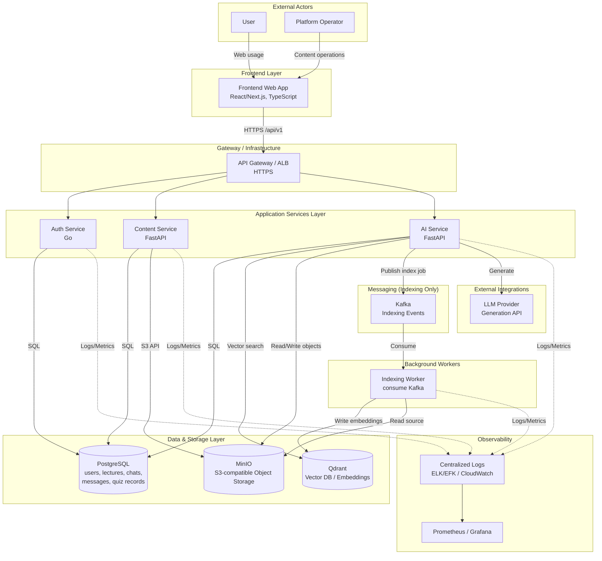
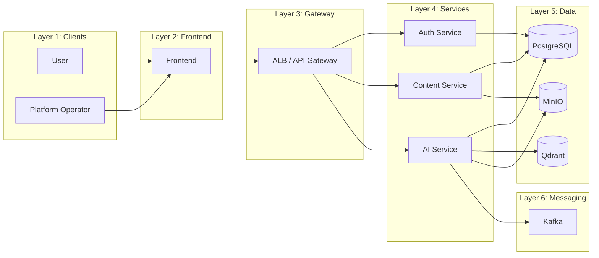

# System Architecture Diagram

## Document Purpose

This document provides a production-level system architecture view of the AI-Powered Educational Platform, derived from BRD, AVD, SOW, database schema, and project overview.

---

## 1. Comprehensive System Architecture Diagram (Mermaid)



---

## 2. Layered View (Simplified)



---

## 3. Data Flow: Typical Request Flows

### 3.1 User Login

```
User -> Frontend (login form)
  -> API Gateway (POST /api/v1/auth/login)
  -> Auth Service
  -> PostgreSQL (validate user, session)
  -> Auth Service (issue JWT access + refresh)
  -> Frontend (store tokens, redirect)
```

### 3.2 List Lectures (Authenticated)

```
User -> Frontend (lecture list)
  -> API Gateway (GET /api/v1/lectures, Bearer token)
  -> Auth middleware (validate JWT)
  -> Content Service
  -> PostgreSQL (lectures + metadata)
  -> Content Service (paginated response)
  -> Frontend (render list)
```

### 3.3 Upload Lecture (Platform Operator)

```
Operator -> Frontend (upload)
  -> API Gateway (POST /api/v1/lectures, Bearer token)
  -> Auth + RBAC (operator role)
  -> Content Service (create metadata, obtain upload link / file_key)
  -> PostgreSQL (insert lecture row)
  -> MinIO (store file via frontend or signed URL)
  -> Content Service (confirm)
  -> Frontend (success)
```

### 3.4 Trigger Indexing (Platform Operator)

```
Operator -> Frontend (index lecture)
  -> API Gateway (POST /api/v1/ai/lectures/{lecture_id}/index)
  -> Auth + RBAC (operator)
  -> AI Service (publish event to Kafka, return job_id 202)
  -> Kafka (topic)
  -> Indexing Worker (consume)
  -> MinIO (read lecture file)
  -> Indexing Worker (chunk, embed)
  -> Qdrant (store vectors)
  -> (optional) PostgreSQL (job status)
  -> Frontend (poll job status or webhook)
```

### 3.5 RAG Chat (User)

```
User -> Frontend (send message)
  -> API Gateway (POST /api/v1/ai/chat/rag, Bearer token)
  -> Auth (validate JWT)
  -> AI Service (synchronous: retrieve context from Qdrant, call LLM, build response)
  -> Qdrant (semantic search for context)
  -> LLM Provider (generate answer with context)
  -> AI Service (persist message, return response)
  -> PostgreSQL (messages insert)
  -> Frontend (display answer + source_documents)
```

### 3.6 Summary / Quiz Generation (Operator or User)

```
Client -> API Gateway (POST /api/v1/ai/lectures/{lecture_id}/summaries or /quizzes)
  -> Auth + RBAC
  -> AI Service
  -> (optional) MinIO / Content Service (lecture content)
  -> LLM Provider (generate summary or quiz)
  -> AI Service (return payload; quiz may be stored in PG)
  -> Frontend (display)
```

---

## 4. Service Roles Summary

| Service | Role |
|--------|------|
| **Frontend** | SPA/SSR UI (React/Next.js). Handles auth token storage, routing, lecture list/detail, RAG chat UI, summary/quiz views. Calls backend via `/api/v1`. |
| **Auth Service** | Identity and token lifecycle. Register, login, refresh, logout, `/me`. Issues JWT access + refresh. Validates tokens for protected routes. Stores users and auth data in PostgreSQL. |
| **Content Service** | Lecture domain. CRUD for lecture metadata, file_key lifecycle, list/filter lectures, get lecture content. Persists metadata in PostgreSQL; binary/artifacts in MinIO. |
| **AI Service** | AI workflows. Triggers indexing (publishes to Kafka); handles RAG chat, summary and quiz generation synchronously. Uses Qdrant for retrieval, MinIO for artifacts, PostgreSQL for chats/messages and quiz records. Calls LLM provider for generation. |
| **Indexing Worker** | Consumes Kafka indexing events. Reads lecture content (e.g. from MinIO), chunks, generates embeddings, writes to Qdrant. Updates job status as needed. |

---

## 5. Components Summary

| Component | Type | Purpose |
|-----------|------|---------|
| **API Gateway / ALB** | Infrastructure | Single HTTPS entry, TLS termination, routing to auth/content/ai services. |
| **PostgreSQL** | SQL Database | Users, lectures metadata, chats, messages, quiz results. Source of truth for transactional data. |
| **Qdrant** | Vector Database | Stores embeddings; semantic search for RAG context retrieval. |
| **MinIO** | Object Storage | S3-compatible store for lecture files (PDF/audio) and generated artifacts (e.g. summaries). |
| **Kafka** | Message Broker | Used only for indexing: ai-service publishes index jobs to a topic; Indexing Worker consumes and processes (chunk, embed, write to Qdrant). |
| **LLM Provider** | External | External AI/LLM API for text generation (summaries, quizzes, RAG answers). |

---

## 6. Assumptions Made

1. **Auth middleware**: JWT validation and RBAC are applied at API Gateway or at each service; documents state "protected endpoints" and "access control middleware" but do not specify whether this is gateway-level or per-service. Diagram assumes gateway routes to services and that services or a shared middleware enforce JWT and roles.

2. **Background workers**: Indexing is event-driven via Kafka; only Indexing Worker consumes from Kafka. RAG is handled synchronously by AI Service (no message broker). Indexing Worker is shown as a separate logical component; deployment may be same or separate from ai-service.

3. **Single PostgreSQL**: Database schema describes tables for users, lectures, chats, messages. Documents do not specify separate DB instances per service; diagram assumes one PostgreSQL with logical ownership (auth: users; content: lectures; ai: chats, messages, quiz data).

4. **RAG**: RAG is synchronous. AI Service performs retrieval from Qdrant and LLM call directly within the request; no message broker is used for chat.

5. **File upload path**: Lecture "file_key" is stored by Content Service; actual file upload may be direct to MinIO (signed URL) or via Content Service. Diagram shows Content Service writing metadata to PG and MinIO as the storage backend; upload path is not refined further.

6. **Observability**: BRD/AVD mention ELK/EFK, Prometheus/Grafana, and SOW mentions CloudWatch Logs. Diagram shows a generic "Centralized Logs" and "Prometheus/Grafana" as observability; no assumption on a single vendor.

7. **LLM Provider**: Referenced as "External AI provider/model runtime" and "LLM provider integration"; no specific product (e.g. OpenAI, Bedrock). Drawn as single external "LLM Provider" box.

---

## 7. Communication Matrix

| From | To | Protocol / Mechanism |
|------|-----|------------------------|
| User / Operator | Frontend | HTTPS (browser) |
| Frontend | API Gateway | HTTPS, REST /api/v1 |
| API Gateway | Auth Service | HTTP/HTTPS (internal) |
| API Gateway | Content Service | HTTP/HTTPS (internal) |
| API Gateway | AI Service | HTTP/HTTPS (internal) |
| Auth Service | PostgreSQL | SQL (TCP) |
| Content Service | PostgreSQL | SQL (TCP) |
| Content Service | MinIO | S3 API (HTTP) |
| AI Service | PostgreSQL | SQL (TCP) |
| AI Service | Qdrant | gRPC/HTTP (vector API) |
| AI Service | MinIO | S3 API (HTTP) |
| AI Service | Kafka | Kafka protocol (produce, indexing only) |
| AI Service | LLM Provider | HTTPS (REST or vendor API) |
| Indexing Worker | Kafka | Kafka protocol (consume) |
| Indexing Worker | Qdrant | gRPC/HTTP |
| Indexing Worker | MinIO | S3 API |
| All services | Logs / Metrics | HTTP or agent (e.g. Prometheus scrape, log forwarder) |

---

## 8. ASCII System Diagram

```
                    EXTERNAL ACTORS
    +------------------+              +------------------+
    |      User        |              | Platform Operator |
    +--------+---------+              +--------+---------+
             |                                  |
             | HTTPS (web)                      | HTTPS (web)
             v                                  v
    +----------------------------------------------+
    |         Frontend (React/Next.js, TS)          |
    +----------------------------------------------+
             |
             | HTTPS /api/v1
             v
    +----------------------------------------------+
    |            API Gateway / ALB                  |
    +--------+------------------+-------------------+
             |                  |                   |
             v                  v                   v
    +-------------+   +----------------+   +----------------+
    |Auth Service |   |Content Service |   |   AI Service   |
    |    (Go)     |   |   (FastAPI)     |   |   (FastAPI)    |
    +------+------+   +--------+-------+   +--------+-------+
           |                   |                     |
           |                   |                     +---> Kafka ----> Indexing Worker ---> Qdrant, MinIO
           |                   |                     |
           |                   |                     RAG: AI Service does Qdrant + LLM synchronously (no broker)
           |                   |                     |
           v                   v                     v
    +------------+      +-----------+      +-----------------+
    | PostgreSQL |      |   MinIO   |      | Qdrant (vectors)|
    | users,     |      | S3-compat |      +-----------------+
    | lectures,  |      | lectures, |
    | chats,     |      | artifacts |             ^
    | messages   |      +-----------+             +-- Indexing Worker, AI Service (RAG sync)
    +------------+            ^
           ^                  |
           |                  +-- Content Service, AI Service
           +-- Auth, Content, AI Service

    EXTERNAL:  LLM Provider <-- AI Service
```

---

## 9. AWS Architecture Diagram (diagrams package)

The project is designed to run on AWS (EC2/ECS/EKS per AVD). The following mapping is used for an AWS-style diagram:

| Component        | AWS / diagram element        |
|------------------|------------------------------|
| API Gateway/ALB  | ALB                          |
| Frontend         | ECS                          |
| Auth/Content/AI  | ECS                          |
| Indexing Worker  | ECS                          |
| PostgreSQL       | RDS                          |
| MinIO            | S3 (S3-compatible)           |
| Qdrant           | GenericDatabase (vector DB)  |
| Kafka            | ManagedStreamingForKafka     |
| LLM              | Bedrock (or external API)    |
| Logs             | CloudWatch Logs              |

To generate the PNG diagram locally (requires Linux/macOS or WSL; `signal.SIGALRM` is not available on Windows):

```bash
pip install diagrams
# from repo root
python scripts/generate_aws_diagram.py
```

Output: `generated-diagrams/eduai-aws-architecture.png`. The script is [scripts/generate_aws_diagram.py](../scripts/generate_aws_diagram.py).

---

This document and the diagrams above summarize the system architecture as a production-style microservices design with clear layers, data flows, and communication patterns derived from the project documentation.
