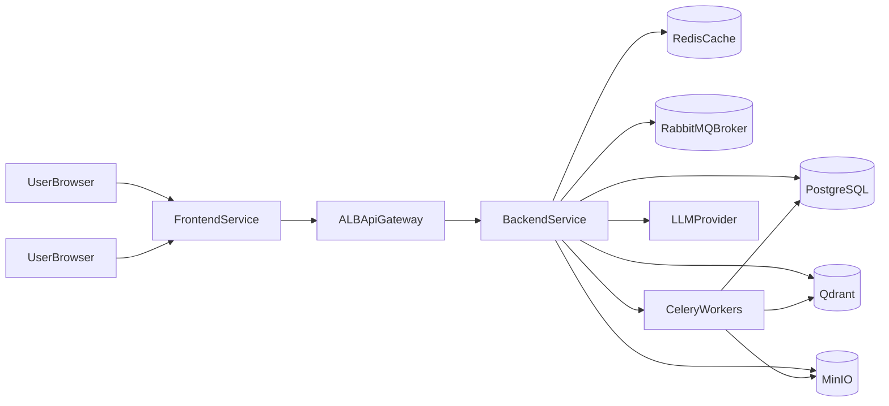

# Техническое задание (ТЗ) EduAI

## 1. Назначение документа

Данный документ определяет полные технические требования для разработки, деплоя и эксплуатации платформы EduAI.

Документ обязателен для:
- backend/frontend разработки;
- DevOps и эксплуатации;
- QA и приемочных проверок;
- архитектурного контроля изменений.

### 1.1 Источники baseline

ТЗ синхронизировано с текущими проектными документами:
- `documents/project_overview.md`
- `documents/BRD.md`
- `documents/AVD.md`
- `documents/system_architecture.md`
- `documents/database_schema.md`
- `documents/SOW.md`

## 2. Границы и целевая модель

### 2.1 Целевая архитектурная модель

- Deployment-модель: **2 отдельных сервиса**:
  - `frontend` service;
  - `backend` service.
- Backend реализуется как **modular monolith** (один deployable runtime) с внутренними модулями:
  - `auth`;
  - `content`;
  - `ai`;
  - `indexing`.

### 2.2 Технологический baseline

- Frontend: Next.js/React + TypeScript.
- Backend: FastAPI (Python) или Go (единый runtime для backend).
- Data:
  - PostgreSQL (транзакционные данные),
  - Qdrant (векторный индекс),
  - MinIO (S3-совместимое хранилище),
  - Redis (только кэш),
  - RabbitMQ (broker для Celery),
  - Celery workers (асинхронные задачи).

### 2.3 Нефункциональные требования (NFR)

- Доступность пилота: >= 99.0% (месячное окно).
- P80 latency:
  - non-AI API <= 3s,
  - RAG <= 10s.
- 100% protected endpoints должны требовать JWT и проверку аутентификации.
- Полная трассируемость запросов через `request_id`/`trace_id`.

## 3. Логическая архитектура



### 3.1 Основные потоки

1. Login:
   - frontend -> backend `/api/v1/auth/login` -> JWT access/refresh.
2. Upload lecture:
   - user -> backend `content` -> metadata в PG + файл в MinIO.
3. Index lecture:
   - backend enqueue Celery task -> RabbitMQ -> worker -> chunk/embed -> Qdrant -> статус в PG.
4. RAG chat:
   - backend `ai` модуль синхронно retrieves context (Qdrant) + LLM -> response + message persistence.
5. Summary/Quiz:
   - backend `ai` генерирует материал по lecture context, сохраняет/возвращает в зависимости от endpoint политики.

## 4. Физическая архитектура (AWS ECS)

### 4.1 Сервисы

- ECS Service `eduai-frontend`:
  - отдельный task definition;
  - autoscaling по CPU/Memory/ALB requests;
  - healthcheck endpoint.
- ECS Service `eduai-backend`:
  - отдельный task definition;
  - autoscaling по CPU/Memory + latency/error signals.

### 4.2 Компоненты данных

- PostgreSQL: managed (предпочтительно RDS) или self-managed в private subnet.
- Redis: ElastiCache/self-managed, используется только для cache.
- RabbitMQ: Amazon MQ (RabbitMQ) или self-managed.
- Qdrant: managed/self-managed.
- MinIO: self-managed S3-compatible storage (или миграция на S3 на следующих этапах).

### 4.3 Сеть и безопасность

- Внешний вход: ALB + HTTPS/TLS.
- Frontend/backend в отдельных ECS services.
- Data plane в private subnets.
- Security groups по принципу least privilege.
- Секреты через AWS Secrets Manager/SSM Parameter Store.

## 5. Конфигурация папок (обязательная)

## 5.1 Root структура репозитория

```text
/
  backend/
  frontend/
  infra/
  documents/
  scripts/
  .github/
```

### 5.2 Backend структура (modular monolith)

```text
backend/
  cmd/
    app/                    # entrypoint backend service
  internal/
    modules/
      auth/
        domain/
        usecase/
        interfaces/
        infrastructure/
      content/
        domain/
        usecase/
        interfaces/
        infrastructure/
      ai/
        domain/
        usecase/
        interfaces/
        infrastructure/
      indexing/
        domain/
        usecase/
        interfaces/
        infrastructure/
    platform/
      config/
      logging/
      middleware/
      security/
      observability/
    adapters/
      db_postgres/
      storage_minio/
      vector_qdrant/
      cache_redis/
      broker_rabbitmq/
      worker_celery/
      llm_provider/
  migrations/
  tests/
    unit/
    integration/
    contract/
  pyproject.toml or go.mod
  Dockerfile
```

### 5.3 Frontend структура

```text
frontend/
  src/
    app/                    # app shell, router, providers
    pages/ or routes/       # route entrypoints
    features/
      auth/
      lectures/
      rag_chat/
      summaries/
      quizzes/
    entities/
      user/
      lecture/
      chat/
      quiz/
    shared/
      api/
      ui/
      lib/
      config/
      types/
  public/
  tests/
    unit/
    integration/
    e2e/
  package.json
  Dockerfile
```

### 5.4 Infra и scripts

```text
infra/
  ecs/
    frontend/
    backend/
  networking/
  monitoring/
  env/
    stage.env.template
    prod.env.template

scripts/
  db/
    migrate.sh
    rollback.sh
    seed.sh
  ops/
    healthcheck.sh
    smoke-test.sh
```

### 5.5 Правила границ

- Модуль backend не импортирует внутренние пакеты другого модуля напрямую минуя публичный interface/usecase контракт.
- Любая внешняя интеграция идет только через `adapters/*`.
- Domain слой не зависит от infrastructure.
- Frontend `features/*` не должен напрямую ходить в инфраструктурные детали, только через `shared/api`.

## 6. Дизайн-паттерны (обязательные)

### 6.1 Backend

- **Hexagonal/Clean boundaries**:
  - domain/usecase слои независимы от транспортов/БД.
- **Repository pattern**:
  - абстракции persistence на границе usecase -> infra.
- **Service + UseCase orchestration**:
  - endpoint вызывает usecase, usecase координирует бизнес-операции.
- **Unit of Work**:
  - для сценариев с несколькими связанными изменениями в БД.
- **Idempotency pattern**:
  - для async trigger endpoints (`/index`, `/summaries`, `/quizzes`) с `Idempotency-Key`.
- **Outbox-ready design**:
  - события домена фиксируются так, чтобы позже можно было выделить модули в микросервисы без полного рефакторинга.

### 6.2 Frontend

- **Feature-Sliced organization**:
  - функциональная декомпозиция через `features/entities/shared`.
- **Container/Presentational split**:
  - в сложных UI экранах отделение orchestration и отображения.
- **API client abstraction**:
  - единый typed API client, единый error mapping.
- **Caching strategy**:
  - SWR/React Query c TTL, stale-while-revalidate, invalidation policy.

## 7. API и контракты

### 7.1 Базовые правила API

- Base path: `/api/v1`.
- Все protected endpoints: `Authorization: Bearer <access_token>`.
- Единый error envelope:

```json
{
  "error": {
    "code": "RESOURCE_NOT_FOUND",
    "message": "Lecture not found",
    "request_id": "req_12345"
  }
}
```

### 7.2 Основные endpoint-группы

- Auth:
  - `POST /api/v1/auth/register`
  - `POST /api/v1/auth/login`
  - `POST /api/v1/auth/refresh`
  - `POST /api/v1/auth/logout`
  - `GET /api/v1/auth/me`
- Content:
  - `POST /api/v1/lectures` (authenticated)
  - `PATCH /api/v1/lectures/{lecture_id}` (authenticated)
  - `DELETE /api/v1/lectures/{lecture_id}` (authenticated)
  - `GET /api/v1/lectures` (authenticated)
  - `GET /api/v1/lectures/{lecture_id}/content` (authenticated)
- AI:
  - `POST /api/v1/ai/lectures/{lecture_id}/index` (authenticated, async)
  - `POST /api/v1/ai/chat/rag` (authenticated, sync)
  - `POST /api/v1/ai/lectures/{lecture_id}/summaries` (authenticated)
  - `POST /api/v1/ai/lectures/{lecture_id}/quizzes` (authenticated)

### 7.3 Контрактная дисциплина

- OpenAPI spec обязателен и version-controlled.
- Breaking changes запрещены без bump API version.
- Contract tests обязательны между frontend и backend.

## 8. Модель данных и эволюция схемы

### 8.1 Текущий минимум

- `users`
- `lectures`
- `chats`
- `messages`

### 8.2 Обязательные расширения v2

1. `ai_jobs`:
   - `job_id`, `task_type`, `status`, `payload`, `error`, `retry_count`, `created_at`, `updated_at`, `finished_at`.
2. Quiz persistence (если нужна история):
   - `quizzes`,
   - `quiz_questions`,
   - `quiz_attempts`,
   - `quiz_answers`.
3. Single-role policy:
   - `users.role` может быть фиксирован как `user` для совместимости, без разделения прав по ролям.

### 8.3 Стандарты данных

- Временные поля: `TIMESTAMPTZ` (единый стандарт).
- Soft delete: `deleted_at TIMESTAMPTZ NULL` вместо флага `deleted`.
- Все внешние ключи с явно заданной delete-policy (`CASCADE`, `RESTRICT`, `SET NULL`).
- Индексы на частые фильтры и сортировки (`user_id`, `lecture_id`, `created_at`, `status`).

## 9. Async processing: Celery + RabbitMQ + Redis

### 9.1 Роли компонентов

- Celery: task execution framework.
- RabbitMQ: broker доставки задач.
- Redis: только кэш (response cache, rate-limit counters, temporary app data).

### 9.2 Очереди

- `indexing_queue` (heavy).
- `summary_queue` (medium).
- `quiz_queue` (medium).

### 9.3 Политики надежности

- Retry policy: exponential backoff.
- Dead-letter/parking queue для задач с превышением лимита retry.
- Идемпотентность задач по `job_id` + request fingerprint.
- Статус задачи хранится в `ai_jobs`.

## 10. Безопасность

### 10.1 AuthN/AuthZ

- JWT access/refresh.
- Refresh token rotation.
- Access model:
  - `user`: read/write content + AI triggers + own chats.

### 10.2 Data protection

- TLS in transit.
- Encryption at rest (DB/object storage).
- Secret rotation policy для ключей и паролей.

### 10.3 Audit

- Аудит privileged действий:
  - upload/update/delete lecture;
  - index/summaries/quizzes triggers;
  - auth events (login/logout/refresh failures).

## 11. Наблюдаемость и эксплуатация

### 11.1 Логи

- JSON logs:
  - `request_id`,
  - `trace_id`,
  - `user_id` (если есть),
  - `service`,
  - `latency_ms`,
  - `error_code`.

### 11.2 Метрики

- API: RPS, P50/P80/P95 latency, 4xx/5xx rate.
- Backend runtime: CPU/memory/restarts.
- Async: queue depth, job duration, fail rate, retry rate.
- Data: DB pool saturation, Redis hit ratio, Qdrant health.

### 11.3 Алерты

- Critical:
  - auth outage,
  - DB down,
  - 5xx spike.
- High:
  - RAG latency breach,
  - queue backlog growth.
- Medium:
  - retry trend increase,
  - cache degradation.

## 12. CI/CD

### 12.1 Pipeline этапы

1. Lint.
2. Unit tests.
3. Integration/contract tests.
4. Security checks (SAST/dependency scan).
5. Build image.
6. Push registry.
7. Deploy stage.
8. Smoke tests.
9. Manual/automated promotion to prod.

### 12.2 Release strategy

- `dev` -> auto deploy to `stage`.
- tagged release `vX.Y.Z` -> deploy `prod`.
- Rollback обязателен и документирован.

## 13. Тестовая стратегия

- Unit tests: бизнес-логика модулей.
- Integration tests: DB, MinIO, Qdrant, RabbitMQ/Celery.
- Contract tests: frontend/backend API contracts.
- E2E:
  - login,
  - lecture upload/list,
  - index flow,
  - RAG chat,
  - summary/quiz flow.
- Load tests:
  - non-AI endpoints,
  - RAG endpoint,
  - queue stress.

## 14. Definition of Done (DoD)

Задача считается завершенной, если:
- реализован код + тесты;
- обновлены API контракты (если менялись);
- обновлены документы (архитектура/операционные runbooks);
- есть метрики/логи для новой функциональности;
- пройден деплой в stage и smoke checks;
- нет критических/высоких дефектов для релиза.

## 15. Критерии приемки проекта

- Все in-scope endpoints доступны и соответствуют контрактам.
- JWT и проверка аутентификации применяются ко всем protected endpoint.
- Асинхронная индексация работает через Celery + RabbitMQ.
- Redis не используется как task broker.
- Наблюдаемость и алерты покрывают критичные точки.
- Frontend и backend развернуты как 2 независимых ECS сервиса.

## 16. Roadmap масштабирования

### Этап 1 (MVP hardening)
- Стабилизация latency.
- Полный `ai_jobs` lifecycle.
- Улучшение RAG relevance metrics.

### Этап 2 (Growth)
- Горизонтальное масштабирование Celery workers по queue depth.
- Оптимизация стоимости inference/caching.
- Расширение аналитики и quiz personalization.

### Этап 3 (Decomposition-ready)
- Выделение модулей в отдельные сервисы при достижении порогов нагрузки/командной сложности.
- Сохранение API контрактов и backward compatibility.

## 17. Обязательные артефакты проекта

- OpenAPI спецификация.
- ERD + миграции.
- Environment matrix (`stage`/`prod`).
- Runbooks:
  - deploy,
  - rollback,
  - incident response.
- Security checklist.
- Performance baseline report.

